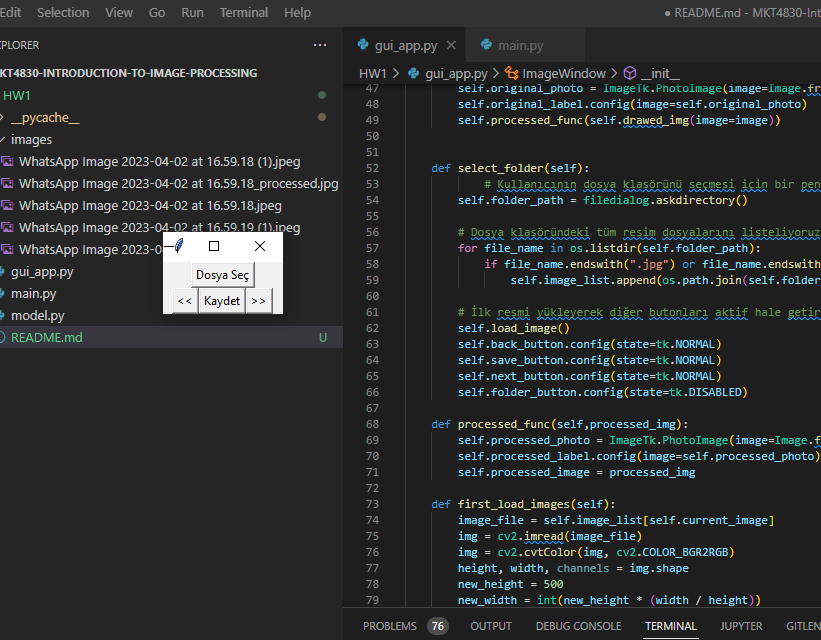
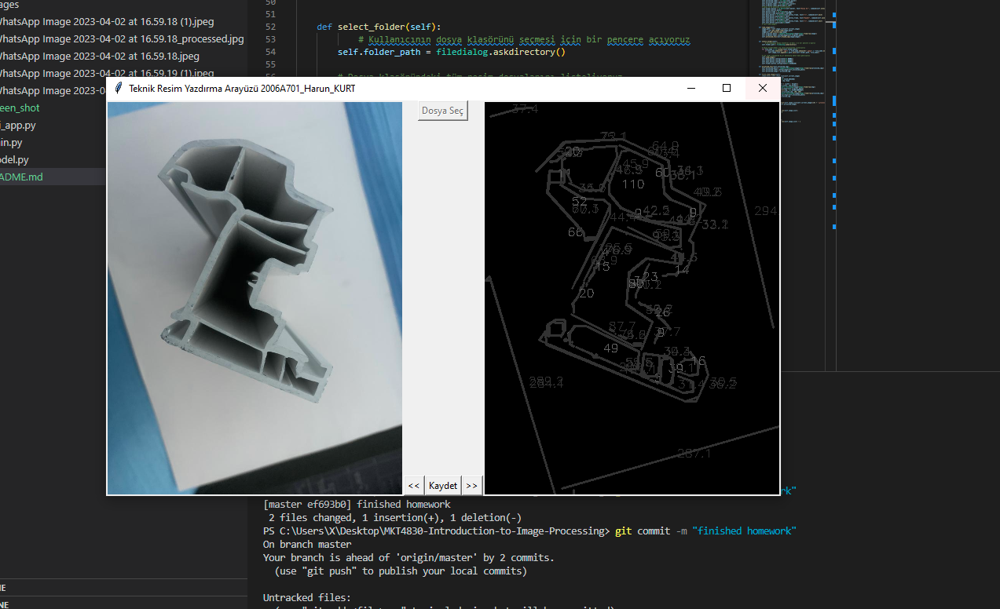
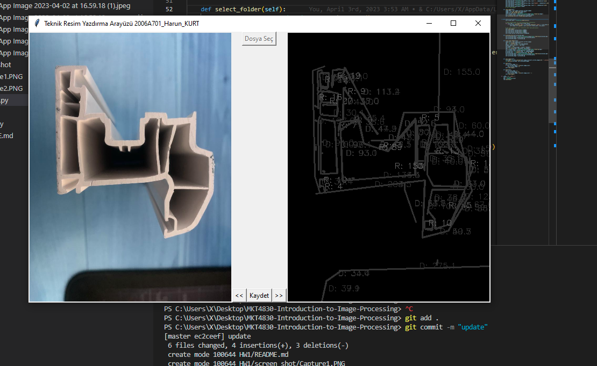

### MKT4830

In this study, the methods I used

first i convert the picture to gray,
Afterwards, I expand the area of pixels related to each other with the official dilation, which turns the gray picture into blur with the gussian blur method, and in the next step, I try to get a cleaner image by removing some noisey pixels with erosion.
I make a list by capturing the edges of the image I obtained, then find its contours. I'm trying to find their lengths and radiuses over their apporxes. then I print their lengths and radiuses on it.

I made the application over tkinter so that it appeals to the end user. And I provide access to the pictures in different folders with the application and save the desired processed picture.

# for folder select

# image showing

# image radius and distance add

